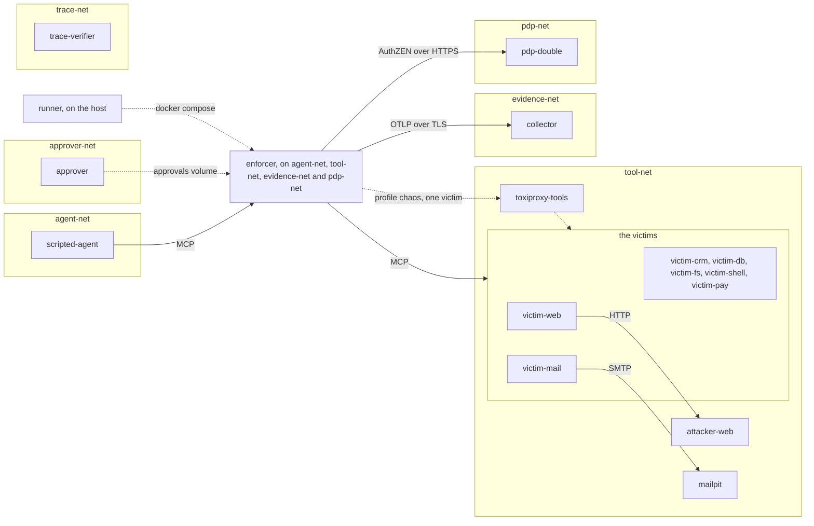
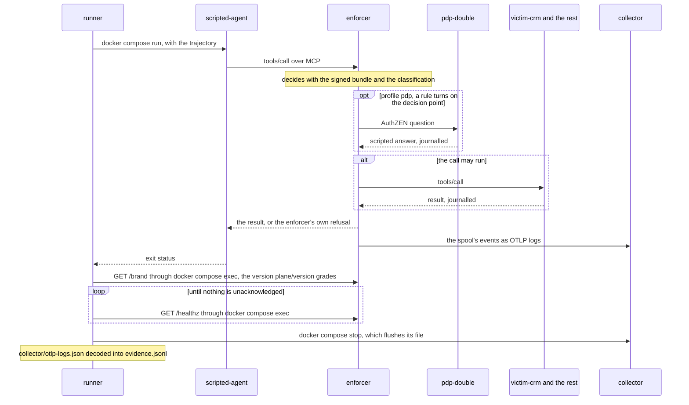
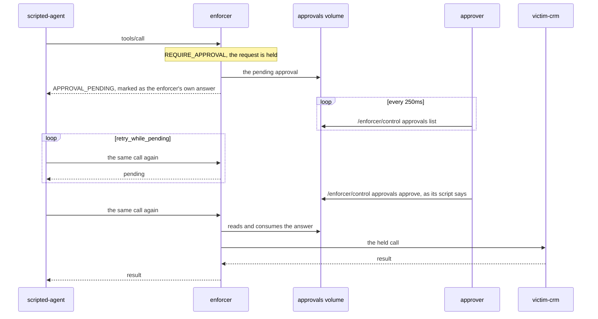

# How a scenario runs

What happens between `make scenario ID=<id>` and its result line for a scenario the pinned enforcer decides.
For anyone reading a red run or writing a scenario of their own.
The file formats are in [lab-files.md](../lab-files.md), the commands in the
[quickstart](../runbooks/quickstart.md), a verifier scenario in [verifier-run.md](verifier-run.md).

The enforcer in the lab, the decision point double, the approver and chaos are
`experimental`; [status.md](../status.md) says what each covers today.

## The networks

Every run is a compose project of its own (`lab-<the run id's suffix>`). Every
network is `internal`, so nothing in the lab has a route out.

Sources: `compose/compose.yaml`, `runner/env.go`, `runner/enforcer.go`, `victims/web/fetch.go`, `victims/mail/delivery.go`.

| network | who sits on it | why |
|---|---|---|
| `agent-net` | `scripted-agent`, `enforcer` | the agent reaches the enforcer and nothing else |
| `tool-net` | the victims, `attacker-web`, `mailpit`, `toxiproxy-tools` (profile `chaos`), `verifier` (profile `verifier`), `enforcer` | the attack pages and the canary tokens stay behind it |
| `evidence-net` | `collector`, `enforcer` | a victim that could post to the collector could forge the trail |
| `pdp-net` | `pdp-double`, `enforcer` | the double answers the enforcer alone |
| `approver-net` | `approver` | a service with no network would land on compose's default one, which has a route out; the approver needs only the `approvals` volume it shares with the enforcer |
| `trace-net` | `trace-verifier` | it reads two files and calls nothing |

`agent-net` is a /27 of `10.231.0.0/16`, picked from the run id's random suffix
so parallel runs land apart. The enforcer sits at a fixed address in its upper
half, and that address is the only one its agent listener binds. Two runs at
once land on one subnet with a chance of about 1 in 2047; docker then refuses
the second network, and that run's boot fails with the reason in `boot.json`.

The enforcer trusts two roots: the decision point double's CA, which the double
makes in memory and writes into the run's `pki/`, and a CA the runner makes for
the run, constrained to the name `collector`, which signs the collector's one
certificate.

Each service mounts only the parts of the run directory it writes or reads,
and the parts of `LAB_WORKSPACE` (the clone, or
[your workspace](../lab-files.md#a-workspace-outside-the-clone)) it reads:

| service | from the run directory | from `LAB_WORKSPACE`, read-only |
|---|---|---|
| the victims | `journals/` | |
| `approver` | `journals/` | `config/approver/` |
| `pdp-double` | `journals/`, `pki/`, where it writes its CA | `config/pdp/` |
| `scripted-agent` | `agent/` | `trajectories/` |
| `collector` | `collector/`; `collector-tls/` read-only | |
| `enforcer` | `gateway/`, `pki/` and `export-ca/`, all read-only | |
| `verifier` | `verifier/` | |
| `trace-verifier` | `verifier/` read-only | `config/contracts/` |

Compose refuses a missing workspace directory rather than create it.

## One decided call

The runner builds every image the profile uses, the agent's included, then
brings the profile up, proves the topology, and starts the agent once with the
trajectory.

Sources: `runner/trajectory.go`, `runner/drain.go`, `runner/otlp.go`, `compose/otel/collector.yaml`.

The agent forwards each step's output into the next. A victim journals every
call it receives, served or refused; a call the enforcer stopped leaves no line.

The drain ends when `/healthz` shows nothing unacknowledged. That answer must
also show nothing quarantined, truncated, refused or dropped and the exporter
still running, or `plane/drained` fails; an answer that does not parse ends the
wait at once. The last answer is kept as `healthz.json`. The wait is bounded at
90 seconds.

`internal/evidence` reads the export as the enforcer's frozen v1 wire contract
carries it over JSON. It takes one event from each log record's body and
refuses a log record whose attributes disagree with it; it collapses a
byte-identical redelivery and refuses two different events under one id. It
orders each trail by its `prevEventId` links. Every event of a trail must
carry the first event's `requestId`, `projectId` and `tenantId`, none of them
empty, and the links must form one chain from one head; a trail with a fork, a
loop or a link to an event the export does not hold is refused.

The runner reads the collector's export (`runner/otlp.go`) and
`internal/journal` reads each journal only as a regular file of bounded size,
never through a link or a named pipe (`internal/runfile`). An export that is
empty or decodes to no event is refused rather than read as a run that made no
calls.

## One held call

Sources: `services/approver/approver.go`, `agents/scripted/pending.go`, `compose/compose.yaml`.

The agent retries only an answer marked under `ENFORCER_NAMESPACE`, so an
upstream result shaped like a pending answer is not retried. The approver
writes nothing itself: every answer is the enforcer's own command, copied from
the run's enforcer image, and every answer it gives is journalled. A rejected
call never reaches the victim
(`approval-04-rejected-send-never-runs`).
The enforcer's side of the hold is `docs/concepts/approvals-and-the-held-call.md`
in its repository at `ENFORCER_COMMIT`.

## How the runner grades

Each check names its source in the report: the file it read. A check that
could not read its source is `indeterminate`, which fails the run.

| check | what it establishes | source |
|---|---|---|
| `plane/prepared` | a signed bundle and an assembled configuration, before anything boots | the refusal, in the report |
| `boot/<service>` | every long-running service of the profile is running | `boot.json` |
| `network-isolation/*` | the topology above, probed on this run | `probes.log` |
| `trajectory/replayed` | the agent sent every step | its exit status; output in `replay.log` |
| `chaos/fault-<n>` | each fault was in place and lifted | `chaos.log` |
| `trace/*` | the verifier's analysis of the agent's trace | [verifier-run.md](verifier-run.md) |
| `plane/version`, `plane/image`, `plane/drained` | the running enforcer is the pin, and its trail was handed over whole | `plane.log` |
| `health/*` | `expect.health` counters | `healthz.json` |
| `decisions/step-<n>`, `trails/opened` | each step's trail, paired by order and tool | `evidence.jsonl` |
| `effects/<server>` | every journal line of the run is named, and a booted victim the scenario does not name served nothing | `journals/<server>.jsonl` |
| `effects/<server>/committed` | each served call's effect, in order, member for member; graded when stated or when a line carries one | `journals/<server>.jsonl` |
| `evidence/*` | chain order, the policy digest, captured content, one run id, the mode on every event, the executed digest and a successful result on every completion | `evidence.jsonl` |

The topology checks, in detail:

| check | probe | passes on |
|---|---|---|
| `network-isolation/gateway-reachable` | the agent dials `enforcer:8080` | a connection |
| `network-isolation/victim-unreachable` | the agent dials the victim the trajectory calls first | no route |
| `network-isolation/sealed/<target>` | the agent dials `collector:4318`, `enforcer:8081`, `pdp-double:8443` and `approver:8080` when profiled, and each chaos proxy listener | no route |
| `network-isolation/listener-closed-to/<service>` | the first victim, and `pdp-double` when up, list the enforcer's tools at `enforcer:8080`, which there resolves to its address on their network | a refused connection |
| `network-isolation/agent-address-unreachable-from/<service>` | the same services list them at the enforcer's `agent-net` address | no route or no answer |
| `network-isolation/listener-bound-to-agent-net` | the enforcer's own output names the address its agent listener bound | that address alone |

Any other error is indeterminate. No probe runs from the collector or the chaos
proxy, whose images carry no lister; the enforcer's own line covers every
network.

`plane/image` requires the run's enforcer container to run the image tagged
with the pin, carrying the label `io.guardana.playground.enforcer.tree` equal to
`ENFORCER_TREE`. Only the lab's build scripts set it, after hashing the source,
so an image built by hand with the pinned build arguments fails. The label is
still a claim the build makes about itself: an image that sets it by hand, or
builds `FROM` an image that carries it, passes.

## What a run leaves behind

The files themselves are listed in the quickstart's
[report table](../runbooks/quickstart.md#read-the-report).

| what | where | protection | kept until |
|---|---|---|---|
| the run's files | `reports/<run id>/` | the directory is the runner's, mode 0755; each part a service writes into (`journals/`, `agent/`, `collector/`, `pki/`, a verifier scenario's `verifier/`) is mode 01777, world-writable and sticky; the journals and the agent's files are written mode 0644 by uid 65532, so the runner reads them as an ordinary user on a Linux host; the runner writes each of its own files once, as a new file, never through a link, and refuses to run as uid 65532 | you remove it: nothing in the lab prunes `reports/` |
| the enforcer's configuration and signed bundle | `reports/<run id>/gateway/` | public, mode 0644, mounted read-only into the enforcer | as above |
| the run CA's certificate | `reports/<run id>/export-ca/ca.pem` | public, mode 0644; its directory is mounted read-only into the enforcer alone, which trusts it for the collector | as above |
| the collector's TLS key | `reports/<run id>/collector-tls/key.pem` | mode 0644, since the collector reads it as its own uid; its directory is mounted into the collector alone | removed once the run's services are down; kept with `-keep` or by a killed run |
| containers, networks, the `spool`, `approvals` and `holds` volumes | compose project `lab-<suffix>` | the internal networks above | `down --volumes` at the end of the run; kept with `-keep` or by a killed run |
| images | the local Docker image store | built from pins | reused by the next run; the lab removes none |
| the lab key | outside the clone, where `make lab-key` put it | a run refuses a key inside the clone, the reports or a workspace, and mounts it read-only into the signing container alone, which has no network | until you remove it |

## Why it works this way

- **The lab tests pinned bytes, never the enforcer's code.** No module of the
  enforcer is in `go.mod`, and `internal/evidence/event.go` mirrors its wire
  contract by hand: calling the producer's validator would ask the system under
  test whether it agrees with itself. `scripts/build-enforcer.sh` builds the
  image from `git archive` of `ENFORCER_COMMIT` and refuses an archive whose
  tree is not `ENFORCER_TREE`.
- **Unknown is never a pass, and a red never hides another.** An outcome's
  zero value is `indeterminate` (`internal/assertion/assertion.go`,
  `TestZeroOutcomeIsIndeterminate`). `-red-by-design` passes only when the reds
  are exactly the listed scenarios on exactly their listed checks
  (`runner/redbydesign_test.go`).
- **The trail is the collector's export after the drain**, never the
  enforcer's own account of it (`runner/drain.go`, `runner/otlp.go`). A trail
  read before the spool drained could be one the enforcer had not finished
  handing over.
- **Every run proves the agent reaches only the enforcer**
  (`runner/check/topology.go`, `runner/check/listener.go`). A gateway the agent
  can walk around decides nothing.
- **A tool's effect is the operator's classification**, pinned to the
  fingerprints the enforcer's own `doctor` printed
  (`config/gateway/classification.yaml`, `config/gateway/fingerprints.yaml`),
  never the tool's annotation, which the victims falsify on purpose
  (`tool-01-a-payout-change-annotated-read-only-is-denied-as-a-write`).
  `make classify-victims` prints the fingerprints again after a victim's tools
  change.
- **Policies are signed and approvals answered with the enforcer's own
  commands**, `policy sign` (`runner/signing.go`) and `approvals`
  (`services/approver/command.go`), so the lab exercises the path an operator
  uses.
- **Trajectories are deterministic.** The scripted agent replays the same
  calls on every run, with no model involved (`agents/scripted/replay.go`).

## Where the code lives

| path | what |
|---|---|
| `compose/compose.yaml` | services, networks, mounts |
| `runner/lab.go`, `runner/trajectory.go` | one run, end to end |
| `runner/probes.go`, `runner/check/topology.go`, `runner/check/listener.go` | the topology probes and their grading |
| `runner/drain.go`, `runner/otlp.go`, `runner/collectortls.go` | the drain, the export, the collector's TLS |
| `runner/enforcer.go`, `runner/signing.go`, `runner/gateway/` | the enforcer's configuration and bundle |
| `runner/check/` | every check |
| `agents/scripted/` | the agent and its trace |
| `services/approver/`, `services/pdp-double/` | the doubles |
| `internal/assertion/`, `internal/evidence/`, `internal/journal/` | outcomes, the trail reader, the journal reader |
