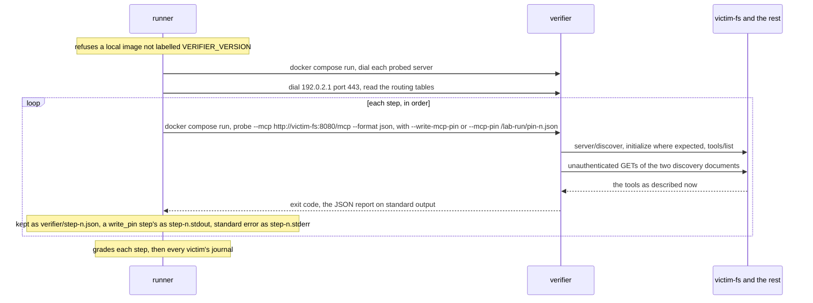
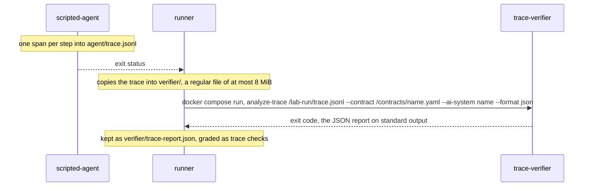

# How a verifier scenario runs

How the runner drives the verifier (`VERIFIER_PACKAGE` at `VERIFIER_VERSION`) in two shapes: probe steps against the victims, and the analysis of the agent's own trace against a contract.
For anyone reading a red verifier or trace check, or bringing a contract of their own.
The step and expectation formats are in [lab-files.md](../lab-files.md#verifier-scenarios); a run through the enforcer is in [scenario-run.md](scenario-run.md).

Both shapes are `experimental` ([status.md](../status.md)).

## Probe steps

A verifier scenario boots the `verifier` profile: the victims, `attacker-web`
and `mailpit`, without the enforcer. `victim-fs` rewrites `fs.read`'s
description on its second `tools/list` and keeps the new text. The enforcer
lists every victim's tools when it starts, so with it up, a `write_pin` step
would pin the rewritten description and a step compared against that pin
would see no drift.

Sources: `runner/verifier.go`, `runner/verifier_reach.go`, `runner/provenance.go`.

Every step, and every reach dial, is a new container from the image
`make verifier-image` built. Compose never pulls that image, and the runner
refuses a local one whose `org.opencontainers.image.version` is not
`VERIFIER_VERSION`, before anything boots.

The verifier sees one host directory, the run's `verifier/`, mounted at
`/lab-run`, where a `write_pin` step writes `pin-<n>.json` and a later step
reads it back with `--mcp-pin`. The victims' journals stay out of its reach.
The runner keeps what a step printed, and the trace report below, only at a
path that does not exist yet, so a file the verifier left under that name fails
the step instead of being graded. It reads every pin and report as a regular
file of at most 8 MiB, never through a link.

## The agent's trace

A scenario with `trace:` runs through the enforcer as usual. After the replay,
the runner hands the agent's own record of the run to the verifier.

Sources: `agents/scripted/trace.go`, `runner/trace.go`, `compose/compose.yaml`.

`trace-verifier` is alone on `trace-net` and mounts two directories read-only:
the run's `verifier/` and `config/contracts/`. It calls nothing. The trace is
the agent's account, so what it can and cannot tell is in
[lab-files.md](../lab-files.md#trace-scenarios); the scenario's decisions and
effects checks grade what the enforcer and the victims recorded.

## What each check reads

| check | passes when | source |
|---|---|---|
| `verifier/image` | never: it is the refusal of an image not built from the pin | the report |
| `compose/loaded` | never: it is the refusal of a run whose compose file did not load for its profile | compose's error, in the report |
| `boot/<service>` | every service of the profile runs | `boot.json` |
| `verifier-reach/<server>` | the verifier's network connects to each probed server | `probes.log` |
| `verifier-reach/no-route-out` | the dial to `192.0.2.1:443` ends in no route or an unknown name; a connection fails it, any other error is indeterminate | `probes.log` |
| `verifier-reach/no-default-route` | neither `/proc/net/route` nor `/proc/net/ipv6_route` in the verifier's container holds a usable default route | `probes.log` |
| `verifier/step-<n>/ran` | never: it is the indeterminate of a step whose container did not start | the report |
| `verifier/step-<n>/pin` | a `write_pin` step left a pin of schema 2 that approves the probed URL and at least one tool | `verifier/pin-<n>.json` |
| `verifier/step-<n>/report` | any other step left a report of schema 6 about the probed URL, naming at least one rule that ran | `verifier/step-<n>.json` |
| `verifier/step-<n>/exit-code` | the exit code is the one stated; beside a missing record it is indeterminate, since a non-zero exit may be docker's | the pin or the report |
| `verifier/step-<n>/finding/<rule>` | a verifier finding of that rule with the stated severity and summary text | the report |
| `verifier/step-<n>/no-finding/<rule>` | the rule ran and left no verifier finding, waived one, unverified result or error | the report |
| `verifier/step-<n>/unverified/<rule>` | the rule is reported unverified | the report |
| `effects/<victim>` | each probed server's journal holds what the scenario states, and every victim it does not name served nothing | `journals/<victim>.jsonl` |
| `trace/*` | as the step checks of the same names, over a report whose target is this run's trace, `/lab-run/trace.jsonl#<run id>` | `verifier/trace-report.json` |

Exit codes 0 to 7 mean what `docs/exit-codes.md` in the verifier's repository
at `VERIFIER_VERSION` says; 2 is an unanswered question, never a clean result.

## Why it works this way

- **The exit code is graded only beside a record**
  (`runner/check/verifier.go`). A container that never reached the verifier
  exits non-zero too, and a 1 from docker is not the verifier's policy gate.
- **A report about another target is a record of something else**
  (`runner/check/verifier_report.go`): its schema, its target and its rules
  run are checked before any verifier finding is read.
- **`no-finding` means the rule ran and concluded**, not that its verifier
  finding is absent (`runner/check/verifier_report.go`). A rule that did not run, could
  not tell, or was waived has established nothing.
- **The victims' journals grade the verifier's own promise** to call no tool
  (`runner/verifier.go`, `everyVictimServesNothing`).
- **The verifier's network is proved sealed on every run**
  (`runner/verifier_reach.go`): a router past the network answers "no
  route" too, so the verifier's own routing tables are read as well.

## Where the code lives

| path | what |
|---|---|
| `runner/verifier.go` | the steps, the run's `verifier/` directory |
| `runner/verifier_reach.go` | the reach dials and the routing tables |
| `runner/trace.go` | the trace handed over and analysed |
| `runner/provenance.go` | the image refusal |
| `runner/check/verifier.go`, `runner/check/verifier_report.go`, `runner/check/trace.go` | the grading |
| `agents/scripted/trace.go` | the trace the agent writes |
| `compose/Dockerfile.verifier`, `compose/verifier/requirements.lock` | the verifier image, hash-locked |
